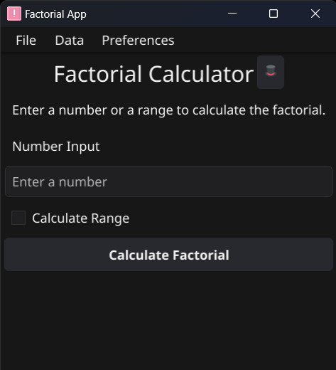

# ❗ Factorial App


This is an over-engineered Factorial desktop app for Windows.

It's available on [here](https://github.com/EduardoProfe666/Factorial-App/releases/latest)

It features both a **Desktop App** and an **API** at the same time

## 📇 Table of Content

* [📖 Main Functionalities](#-main-functionalities-)
* [🛠️ How it works?](#-how-it-works)
  * [🌟 Overview](#-overview-)
  * [📝 Detailed Steps](#-detailed-steps-)
  * [📄 Code Explanation](#-code-explanation-)
  * [🔑 Key Points](#-key-points-)
* [🖥️ Desktop App](#-desktop-app)
  * [🪶 Features](#-features)
  * [▶️ Usage](#-usage)
  * [📸 Screenshots](#-screenshots-)
  * [😵‍💫 Troubleshooting](#-troubleshooting-)
* [🌌 API](#-api)
  * [🛣️ Endpoints](#-endpoints-)
  * [🔑 Key Points](#-key-points--1)
* [🚀 Deploy with Fyne-Cross on Windows](#-deploy-with-fyne-cross-on-windows)
* [📦 Project Installation](#-project-installation-)

## 📖 Main Functionalities 
- [x] Single number factorial calculation
- [x] Range number factorial calculation
- [x] Concurrent factorial calculus
- [x] Usage of BigInt in factorial calculus to calculate big numbers
- [x] Usage of Sqlite3 database to store results and retrieve them later
- [x] Export to CSV
- [x] Fyne Desktop App
- [x] Light/Dark Mode
- [x] Txt formatted logs with levels
- [x] Fully functional local [API](#-api)

## 🛠️ How it works?

The factorial calculation in this application is designed to be efficient
and scalable, leveraging Go's concurrency features to handle large numbers.
The core logic is implemented in the `Factorial` function within the `logic` package.

### 🌟 Overview 

The `Factorial` function computes the factorial of a given number using concurrent goroutines.
This approach divides the computation into smaller chunks, which are then processed in parallel,
significantly improving performance for large inputs.

### 📝 Detailed Steps 

1. **Input Validation**:
  - If the input number is less than or equal to 1, the function immediately returns `1` as the factorial of such numbers.

2. **Goroutine Allocation**:
  - The number of goroutines is determined based on the input number. By default, it uses 4 goroutines. If the input number is less than 4, it adjusts the number of goroutines to match the input number.

3. **Chunk Division**:
  - The input number is divided into chunks, each assigned to a separate goroutine. The size of each chunk is calculated by dividing the input number by the number of goroutines.

4. **Concurrent Calculation**:
  - Each goroutine calculates the factorial of its assigned chunk concurrently. The results are sent to a shared channel (`results`).

5. **Result Aggregation**:
  - After all goroutines complete their calculations, the main function reads from the `results` channel and multiplies the partial results to obtain the final factorial.

### 📄 Code Explanation 

```go
package logic

import (
	"math/big"
	"sync"
)

func Factorial(number int) *big.Int {
	if number <= 1 {
		return big.NewInt(1)
	}

	numGoroutines := 4
	if number < numGoroutines {
		numGoroutines = number
	}

	results := make(chan *big.Int, numGoroutines)
	var wg sync.WaitGroup
	wg.Add(numGoroutines)

	chunkSize := number / numGoroutines
	for i := 0; i < numGoroutines; i++ {
		start := i*chunkSize + 1
		end := (i + 1) * chunkSize
		if i == numGoroutines-1 {
			end = number
		}
		go func(start, end int) {
			defer wg.Done()
			partial := big.NewInt(1)
			for j := start; j <= end; j++ {
				partial.Mul(partial, big.NewInt(int64(j)))
			}
			results <- partial
		}(start, end)
	}

	go func() {
		wg.Wait()
		close(results)
	}()

	result := big.NewInt(1)
	for partial := range results {
		result.Mul(result, partial)
	}

	return result
}
```

### 🔑 Key Points 

- **Concurrency**: Utilizes Go's concurrency model to divide the workload and process it in parallel.
- **Efficiency**: By breaking down the problem into smaller parts, the function can handle large inputs more efficiently.
- **Scalability**: The number of goroutines can be adjusted based on the input size, ensuring optimal performance.


## 🖥️ Desktop App

The Desktop App is a feature-rich application designed to provide users with a seamless
experience for calculating factorials and managing factorial results. Built
using the Fyne toolkit in Go, it offers a modern and intuitive user interface.
The app integrates with a backend API to handle calculations and data storage, ensuring
efficient performance and reliability.

### 🪶 Features

1. **Factorial Calculation**:
  - Users can input a number to calculate its factorial.
  - The app leverages concurrent processing to handle large numbers efficiently.

2. **Result Management**:
  - Users can view a list of previously calculated factorial results.
  - Results can be deleted or exported to a CSV file.

3. **Range Calculation**:
  - Users can specify a range of numbers to calculate factorials for all numbers within that range.

4. **User-Friendly Interface**:
  - The app provides a clean and intuitive interface, making it easy for users to navigate and interact with the functionalities.

### ▶️ Usage

1. **Launch the App**:
  - Run the compiled binary to start the Desktop App.

2. **Calculate Factorial**:
  - Enter a number in the input field and click "Calculate" to compute the factorial.

3. **View Results**:
  - Click on the "Results" tab to view a list of previously calculated factorials.

4. **Manage Results**:
  - Use the "Delete" button to clear all results.
  - Use the "Export" button to save results to a CSV file.

5. **Calculate Range**:
  - Enter the lower and upper bounds of a range and click "Calculate Range" to compute factorials for all numbers within the range.

### 📸 Screenshots 

- **Home Screen**
> 

### 😵‍💫 Troubleshooting 

- **Common Issues**:
  - **API Connection**: Ensure the API server is running and accessible.
  - **Permissions**: : Ensure that the application has been granted the requisite permissions to write files, which is essential for exporting results. Additionally, verify that the API has the necessary internet permissions to facilitate seamless communication with the backend services. Lastly, confirm that the application is permitted to execute on your Windows device, adhering to any applicable security policies and user settings.

- **Support**:
  - For any issues or feature requests, please open an issue on the [GitHub repository](https://github.com/EduardoProfe666/Factorial-App/issues).

## 🌌 API

The API provides a set of endpoints to interact with the 
Factorial App, allowing users to retrieve, delete, and export
factorial results, as well as calculate factorials and factorial ranges. 
The API is built using Go and runs on `localhost:2999`.

### 🛣️ Endpoints 

#### 1. Get Results

- **URL**: `/results`
- **Method**: `GET`
- **Description**: Retrieves all stored factorial results from the database.
- **Response**:
  - **200 OK**: Returns a JSON array of factorial results.
  - **500 Internal Server Error**: If there is an error retrieving the results.

#### 2. Delete Results

- **URL**: `/delete`
- **Method**: `DELETE`
- **Description**: Deletes all stored factorial results from the database.
- **Response**:
  - **200 OK**: Returns a confirmation message.
  - **500 Internal Server Error**: If there is an error deleting the results.

#### 3. Export Results to CSV

- **URL**: `/export`
- **Method**: `GET`
- **Description**: Exports all stored factorial results to a CSV file.
- **Response**:
  - **200 OK**: Returns a confirmation message and creates a `results.csv` file.
  - **500 Internal Server Error**: If there is an error exporting the results.

#### 4. Calculate Factorial

- **URL**: `/factorial`
- **Method**: `GET`
- **Description**: Calculates the factorial of a given number.
- **Query Parameters**:
  - `number`: The number for which to calculate the factorial.
- **Response**:
  - **200 OK**: Returns the factorial result as a JSON string.
  - **400 Bad Request**: If the provided number is invalid.
  - **500 Internal Server Error**: If there is an error calculating the factorial.

#### 5. Calculate Factorial Range

- **URL**: `/range`
- **Method**: `GET`
- **Description**: Calculates the factorials of a range of numbers.
- **Query Parameters**:
  - `lower`: The lower bound of the range.
  - `upper`: The upper bound of the range.
- **Response**:
  - **200 OK**: Returns a confirmation message.
  - **400 Bad Request**: If the provided range is invalid.
  - **500 Internal Server Error**: If there is an error calculating the factorials.

### 🔑 Key Points 

- **Concurrency**: Utilizes Go's concurrency model to handle multiple requests efficiently.
- **Error Handling**: Provides detailed error messages and status codes for better debugging and user feedback.
- **Data Serialization**: Uses JSON and CSV formats for data exchange, ensuring compatibility and ease of use.


## 🚀 Deploy with Fyne Cross on Windows
The app is built on windows with for arm64 arq, and it's available [here](https://github.com/EduardoProfe666/Factorial-App/releases/latest)

## 📦 Project Installation 

1. **Prerequisites**:
- Go (version 1.19 or higher)
- Fyne toolkit

2. **Clone the Repository**:
   ```sh
   git clone https://github.com/EduardoProfe666/Factorial-App.git
   cd Factorial-App
   ```

3. **Build the App**:
   ``` sh
   go build -o factorial-app
   ```

4. **Run the App**:
   ```sh
   ./factorial-app
   ```